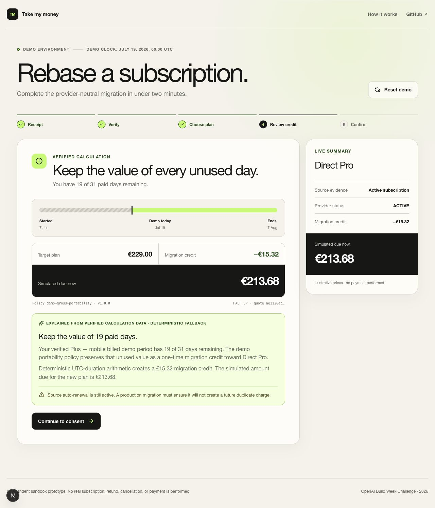
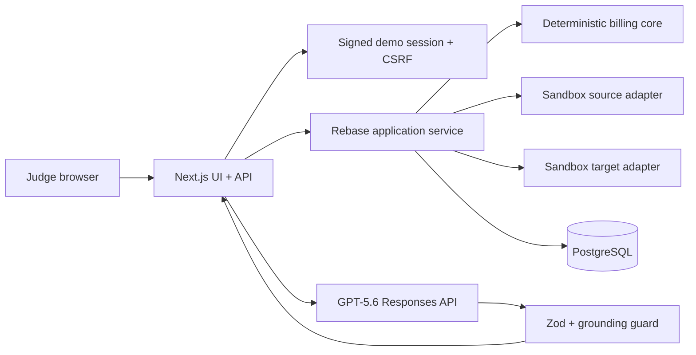

# Take my money

> Upgrade now. Keep every paid day.

[](https://github.com/mitiay7/take-my-money/actions/workflows/ci.yml)
[](LICENSE)

Take my money is a subscription-portability sandbox for the OpenAI Build Week Challenge. It converts the unused value of an active mobile-billed subscription into a controlled, one-time credit toward a new direct plan.

**Public demo:** https://take-my-money-psi.vercel.app

**Source:** https://github.com/mitiay7/take-my-money



## The problem

A customer may want a direct plan while an existing paid subscription is still controlled by another billing platform. Starting immediately can mean paying twice; waiting creates friction and support work.

## The solution

The demo makes the portability sequence explicit:

```text
Synthetic receipt → GPT-5.6 extraction → provider verification
→ deterministic unused-value calculation → one-time migration credit
→ idempotent target simulation → append-only ledger and audit
```

The default fixed-time scenario has 19 of 31 paid days remaining. Exact integer arithmetic turns a EUR 24.99 source period into a EUR 15.32 credit, leaving EUR 213.68 due on an illustrative EUR 229.00 plan.

## What is real and what is simulated

Real in the demo:

- GPT-5.6 Responses API image understanding when `OPENAI_API_KEY` is configured;
- Zod Structured Outputs and numerical grounding checks;
- bigint-only UTC proration, eligibility policy, state machine, idempotency, locking, saga compensation, reconciliation, ledger, and audit;
- PostgreSQL persistence, signed anonymous sessions, CSRF checks, rate limits, responsive UI, and automated tests.

Simulated:

- every receipt, source transaction, provider response, plan, and price;
- source-provider verification and target-subscription creation;
- payment, cancellation, refund, entitlement transfer, tax, and accounting effects.

No login or card is required. Arbitrary receipt upload is disabled.

## Architecture



See [Architecture](docs/ARCHITECTURE.md) and [Billing algorithm](docs/BILLING_ALGORITHM.md) for the complete diagrams and invariants.

## GPT-5.6 usage

GPT-5.6 has two narrow roles:

1. Read a version-controlled synthetic PNG and return unverified receipt fields through a strict Zod schema.
2. Explain sanitized, server-calculated migration facts through a second schema.

The model never calculates credit, decides eligibility, consumes a source, authorizes value, changes state, or calls a billing provider. Unsupported numerical claims are rejected and replaced with deterministic copy. Requests use hashed safety identifiers, `store: false`, a 15-second timeout, one bounded retry, and PostgreSQL-backed usage limits. The whole migration remains usable without AI.

See [AI boundaries](docs/AI_BOUNDARIES.md).

## Local setup

Requirements: Node.js 22+, pnpm 11.15.1 through Corepack, Docker, and Chromium for E2E tests.

```bash
git clone https://github.com/mitiay7/take-my-money.git
cd take-my-money
corepack enable
pnpm install --frozen-lockfile
cp .env.example .env.local
docker compose up -d db
pnpm db:migrate
pnpm db:seed
pnpm dev
```

Open http://localhost:3000. The fallback path needs no OpenAI key.

### Environment variables

| Variable                       | Required | Purpose                                                    |
| ------------------------------ | -------- | ---------------------------------------------------------- |
| `DATABASE_URL`                 | Yes      | PostgreSQL connection; pooled URL in serverless production |
| `SESSION_SIGNING_SECRET`       | Yes      | At least 32 random bytes; server-only                      |
| `OPENAI_API_KEY`               | No       | Enables live GPT-5.6 calls                                 |
| `OPENAI_MODEL`                 | No       | Defaults to `gpt-5.6`                                      |
| `ENABLE_AI`                    | No       | `true` enables live calls when a key exists                |
| `ENABLE_CUSTOM_RECEIPT_UPLOAD` | No       | Must remain `false` in the public demo                     |
| `DEMO_MODE`                    | No       | Must remain `true` for synthetic public behavior           |

Never use a `NEXT_PUBLIC_*` variable for secrets.

## Tests

```bash
pnpm format:check
pnpm typecheck
pnpm lint
pnpm test
pnpm exec playwright install chromium
pnpm test:e2e
pnpm build
```

The Vitest suite uses real PostgreSQL for repository and saga integration tests and a mocked Responses client for AI tests. Playwright runs the full journey and blocked flow on desktop and 390 px-class mobile profiles, including Axe accessibility scans.

## Demo scenarios

| Scenario              | Expected decision                                 |
| --------------------- | ------------------------------------------------- |
| Active subscription   | EUR 15.32 credit; completes                       |
| One day remaining     | Small HALF_UP-rounded credit                      |
| Expired subscription  | Blocked: no portable unused value                 |
| Refunded transaction  | Blocked by verified provider status               |
| Already migrated      | Blocked by exactly-once protection                |
| Billing retry         | Manual review required                            |
| Credit exceeds target | Zero due plus visible carry-forward               |
| AI unavailable        | Deterministic fallback; migration still completes |
| Unknown target result | Safe pause followed by idempotent reconciliation  |

## Repository structure

```text
app/                       Next.js pages and JSON routes
components/                Consumer, result, and system-view UI
db/                        Drizzle schema, migrations, seed
lib/application/           Rebase orchestration and read models
lib/openai/                Schemas, Responses runtime, grounding, fallback
lib/providers/             Source and target sandbox adapters
lib/repositories/          PostgreSQL persistence boundaries
packages/billing-core/     Framework-independent bigint domain core
packages/provider-contracts/ Provider interfaces
packages/shared-contracts/ Zod HTTP contracts
tests/                     Unit, PostgreSQL integration, Playwright E2E
docs/                      Architecture, risk, integration, submission docs
```

## Security and privacy

- Only built-in synthetic images can reach vision extraction.
- Anonymous sessions are signed, HTTP-only, SameSite cookies with CSRF-bound mutations.
- Transaction identifiers are fingerprinted or redacted; system exports are sanitized.
- OpenAI input contains a local fixture or verified minimum facts, never cookies, keys, or full provider identifiers.
- Database constraints, advisory locks, idempotency records, and append-only entries enforce financial invariants.

See [Threat model](docs/THREAT_MODEL.md).

## Production requirements

A real launch needs authoritative provider APIs, customer identity binding, entitlements, finance-approved credit policy, billing catalog and checkout, tax/accounting treatment, fraud controls, consent/legal review, cancellation coordination, support tooling, and reconciliation operations. None is implied by this sandbox.

See [Production integration](docs/PRODUCTION_INTEGRATION.md).

## Codex collaboration and human decisions

The human supplied the product brief, complete acceptance criteria, safety boundaries, contest ambition, and authorization to publish/deploy. Codex performed repository research, architecture, implementation, tests, visual iteration, documentation, GitHub publishing, and deployment work. The human-owned product decisions include the portability problem, synthetic-only public scope, provider-neutral direction, gross-value policy, fixed demo date, consent language, and rule that the LLM cannot control money. The detailed build record is in [CODEX_BUILD_LOG](docs/CODEX_BUILD_LOG.md).

## Known limitations

- The public demo does not bind a real customer or provider account.
- Live GPT-5.6 behavior requires the deployer’s API key; honest fallback is otherwise shown.
- Sandbox prices and policy are illustrative, not financial or legal advice.
- Demo rows are not yet pruned by a scheduled retention job.
- Provider adapters model contracts but do not verify signed production receipts.

## License

[MIT](LICENSE)

## Contest disclaimer

Take my money is an independent sandbox prototype created for the OpenAI Build Week Challenge. It is not an official OpenAI, ChatGPT, Apple, App Store, or payment-provider product. It does not access real subscriptions, issue refunds, cancel renewals, charge payment methods, or modify real account plans. All receipts, transactions, prices, providers, and billing operations shown in the public demo are synthetic or illustrative.
