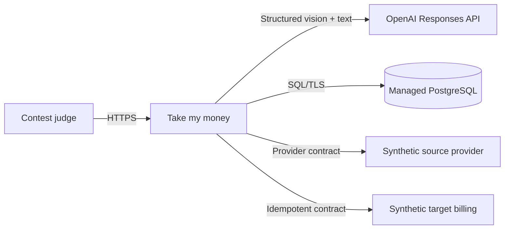
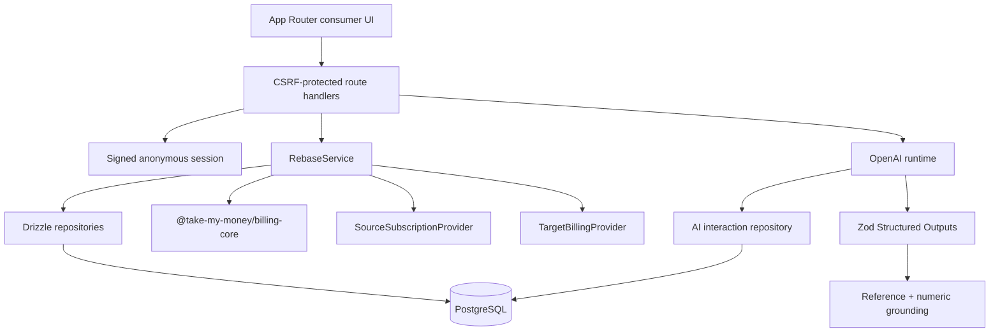
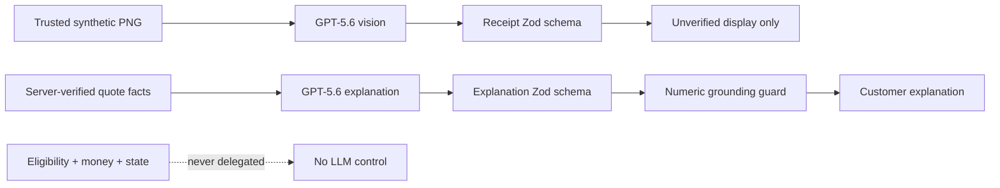
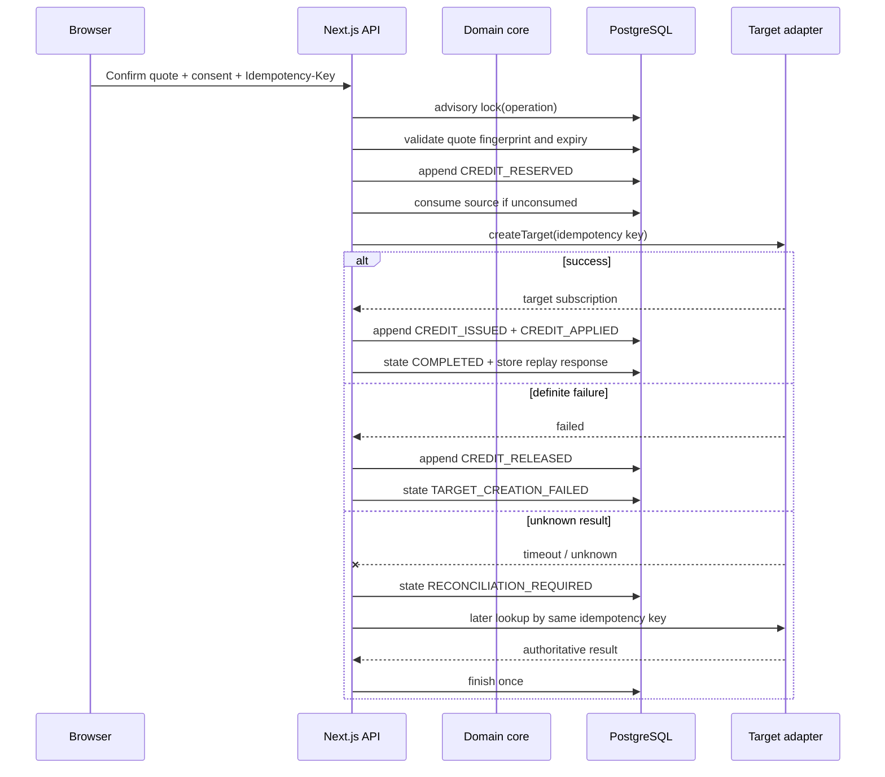
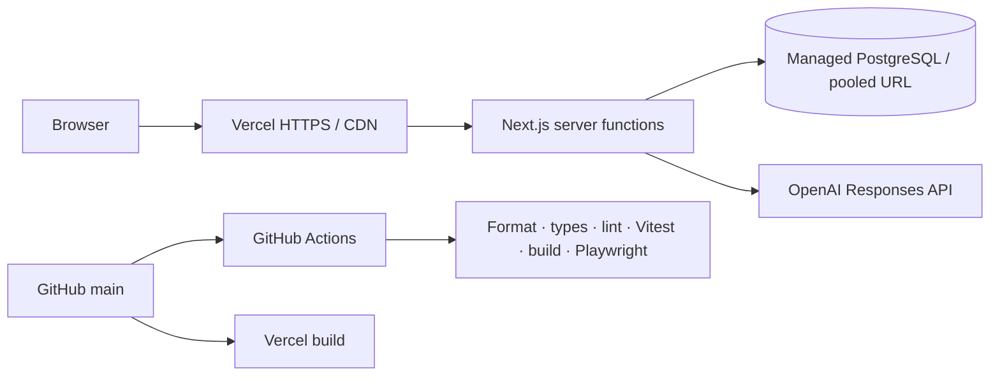

# Architecture

## System context

Source and target providers are in-process sandbox adapters in the public prototype. Their interfaces mark the boundary where authoritative production systems would connect.

## Component view

`billing-core` has no React, Next.js, database, provider, or OpenAI dependency. It owns money, UTC duration, eligibility, policy, rounding, and legal state transitions.

## Data flow

1. A signed anonymous session selects one of nine fixed scenarios.
2. The server maps a trusted receipt asset ID to a version-controlled PNG.
3. GPT-5.6 returns schema-validated but explicitly unverified evidence; fallback returns the same contract.
4. The source adapter returns an authoritative normalized subscription snapshot.
5. The domain core evaluates eligibility and computes a bigint quote from immutable inputs.
6. The customer accepts three explicit sandbox consents.
7. The saga reserves credit, consumes the source exactly once, makes an externally idempotent target call, then commits or releases ledger value.
8. Consumer and technical read models expose only session-owned, sanitized data.

## Provider boundaries

`SourceSubscriptionProvider` verifies and refreshes source state. `TargetBillingProvider` creates or looks up a target result using a stable external idempotency key. Provider-specific identifiers never enter the consumer response in full. Sandbox transaction identity is namespaced per demo session so judges can run concurrently; production adapters would use true provider transaction identity.

## AI boundary

## Migration saga

## Deployment

Migrations and seed run as an explicit release step against managed PostgreSQL, not during concurrent serverless builds.
